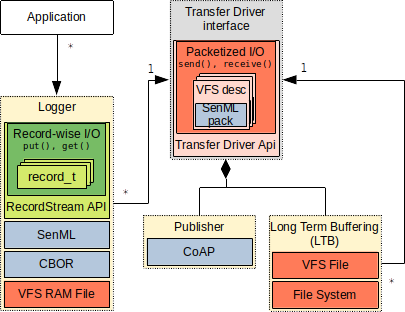

## Constrained Data Logging Framework (ConDaLF) - client library
Data logging tools based on RIOT OS

This is the client side of the CoDaLF framework, a C library that provides basic modules for data point serialization, long time buffering and sending, aimed at devices with constrained resources. These modules can be statically enabled/disabled, yet are run-time configurable. Packaged as an external module for the [RIOT-OS](https://www.riot-os.org/), the library can be used on almost every platform that is supported by the OS. The user can furthermore take advantage of the whole RIOT ecosystem for the rest of the implementation. The straight-forward way to use it is complementary to the [ConDaLF backend](https://github.com/renebckr/ConDaLF-Backend), however, the standard protocols for packaging and sending data used by the framework ensure complete decoupling from the backend choice.

## Building and integrating ConDaLF in a project

The library is packaged as an external module for the RIOT OS. Follow the RIOT instructions about [how to create a RIOT application](https://api.riot-os.org/creating-an-application.html) and [how to register an external module](https://doc.riot-os.org/creating-modules.html#modules-outside-of-riotbase). The RIOT build system will take care for building and linking the library.   
Additionally, refer to [usecase/Makefile](usecase/Makefile) for a real example.

## Modules overview

ConDaLF client library consists of following modules:

### Publisher
This module sends in [CBOR](https://datatracker.ietf.org/doc/html/rfc8949)-encoded [SenML](https://datatracker.ietf.org/doc/html/rfc8428) packs to a given CoAP server and resource. For asynchronous transfers, all instances share a common thread where the jobs are queued. If not used, this module can be turned of statically by setting the ```CONDALF_USE_PUBLISHER``` variable in the project makefile to 0. 

### Long Term Buffering (LTB)
This module handles the long term storage of the SenML packs. Each instance has its own working directory, and can be coupled to at most one *publisher* (if used). The module subsystem keeps track of the packs stored across all instances and can initiate on a specific event a common publishing session. This is an useful feature wherever burst-transfers are preferred. The triggering event is a condition provided by the user, or can be forced at any point in time. To greatly reduce the concurrency complexity and to avoid opening too many files in parallel (file systems usually use large buffers for each open file), the instances share a common dispatch queue for both synchronous and asynchronous transfers. This module can also be turned off by setting the ```CONDALF_USE_LTB``` variable in the project makefile to 0.

### Logger
The logger serializes data into CBOR-encoded SenML packs. It is bound to exactly one transfer driver (*Publisher* or *LTB*). Whenever a pack is complete, it is queued on the transfer driver. This is done asynchronously, as the *Logger* is non-blocking. This module cannot be disabled.

### Remote Diagnostics Logging (RDLOG)
This newly added module is a convenience wrapper around a *Logger*, and provides the user with printf-like, level-enabled logging functions that do not only print to stdout, but also encode the strings in SenML packs that can be forwarded to a transfer driver. This module can be statically disabled by setting the ```CONDALF_USE_RDLOG``` variable in the project makefile to 0.



## Configuration
The afore mentioned modules are all enabled by default. To disable the e.g. LTB module, you can add following line in your project makefile:
```
CONDALF_USE_LTB = 0
```
Further configuration defines are found in [condalf/inc/condalf_config.h](condalf/inc/condalf_config.h). 
All these defines can be overriden by appending the `CFLAGS` variable in the makefile, e.g.:
```
CFLAGS += -DPUBLISHER_QUEUE_PRIO=(THREAD_PRIORITY_MAIN - 2)
```

## Further documentation and examples	
The library is documented with doxygen. Refer to the [usecase](usecase/) directory for a well-documented example. For further help regarding RIOT, refer to the [RIOT documentation](https://api.riot-os.org/index.html).